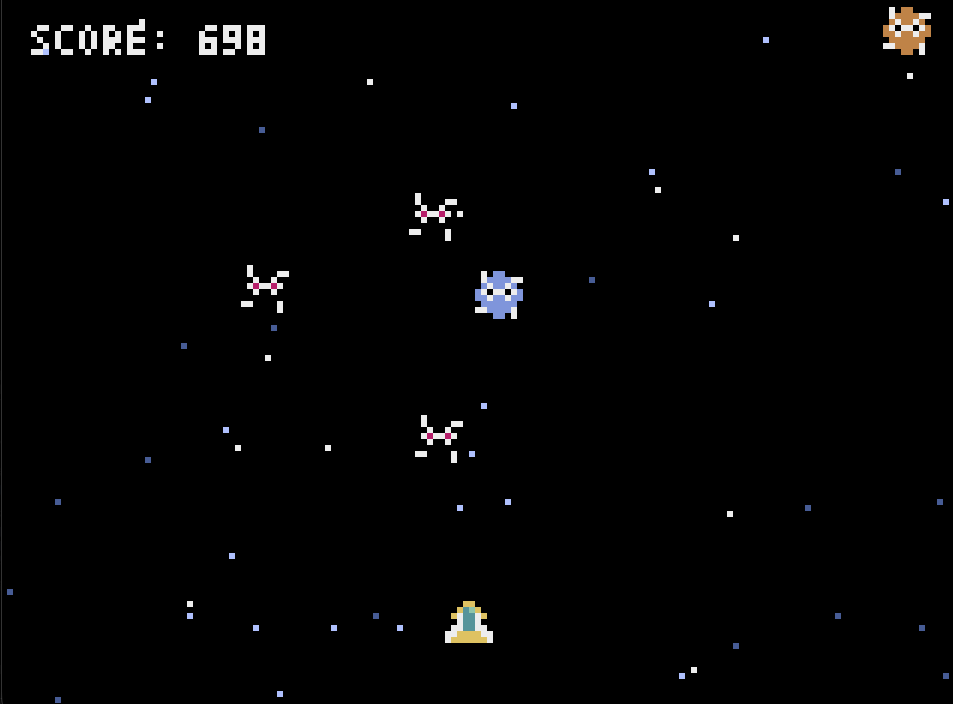

# Space Battle

宇宙船を操作してエイリアンを避けるレトロ風アクションゲーム



## 概要

Space Battleは、Pyxelで作成したレトロ風の2Dアクションゲームです。宇宙船を左右に操作して、上から降ってくるエイリアンを避け続けてハイスコアを目指しましょう！

## 特徴

- レトロなドット絵グラフィック
- 5種類のエイリアン（それぞれ異なる動きと速度）
- スコアに応じて難易度が上昇
- 流れる星のアニメーション背景
- シンプルで直感的な操作

## 必要環境

- Python 3.7以上
- Pyxel

## インストール

1. リポジトリをクローン：
```bash
git clone https://github.com/koo-ke/space-battle.git
cd space-battle
```

2. Pyxelをインストール：
```bash
pip install pyxel
```

## 遊び方

ゲームを起動：
```bash
python3 space_battle.py
```

### 操作方法

- **←キー（左矢印）**: 宇宙船を左に移動
- **→キー（右矢印）**: 宇宙船を右に移動
- **スペースキー**: ゲーム開始 / タイトルに戻る

### ゲームルール

1. 画面下部の宇宙船を左右に操作します
2. 上から降ってくるエイリアンを避け続けます
3. エイリアンに接触するとゲームオーバー
4. 時間経過でスコアが増加します
5. スコアが高くなるほど、エイリアンの出現速度が上がります

### エイリアンの種類

ゲームには5種類のエイリアンが登場します：

- **タイプ1（灰）**: 標準的な速度で降下
- **タイプ2（茶）**: 速めの速度で降下
- **タイプ3（赤）**: かなり速い速度で降下
- **タイプ4（青）**: ゆっくりスタートして徐々に加速
- **タイプ5（黒）**: 遅い速度で降下

スコアが100を超えるごとに、新しい種類のエイリアンが出現するようになります。

## ゲームシステム

- **難易度調整**: スコアが100増えるごとに、エイリアンの出現間隔が短くなります
- **エイリアン解放**: スコアに応じて、より多様なエイリアンが出現します
  - 0-99点: 1種類
  - 100-199点: 2種類
  - 200-299点: 3種類
  - 300-399点: 4種類
  - 400点以上: 5種類全て

## 技術情報

- **開発言語**: Python
- **ゲームエンジン**: Pyxel
- **解像度**: 160 × 120ピクセル
- **フレームレート**: 30 FPS

## ライセンス

このプロジェクトはオープンソースです。

## 作者

koo-ke

---

楽しいゲームプレイを！
